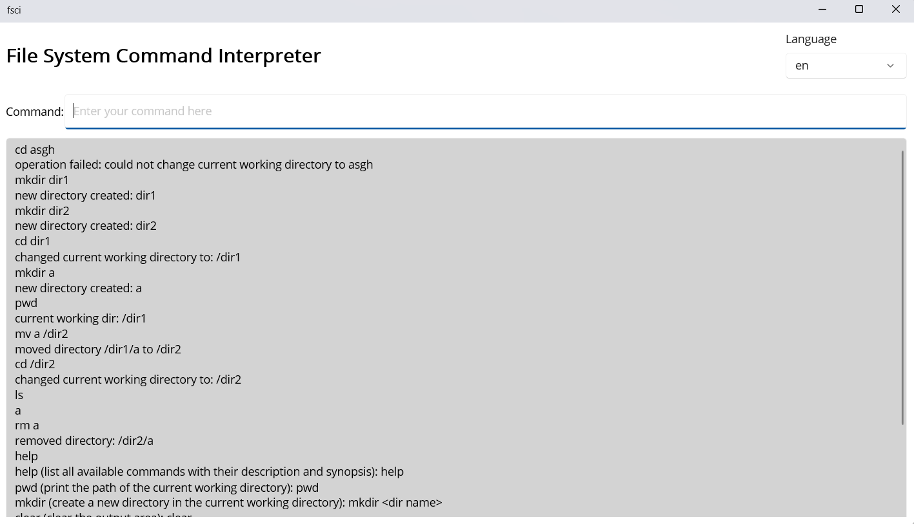

# File System Command Interpreter
Command interpreter for manipulating a Directed Acyclic Graph (DAG), simulating a minimal filesystem, developed in .NET.

### Commands supported
- **cd &lt;path&gt;**: change the current working directory.
- **ls**: list the content inside the current working directory.
- **mkdir &lt;dir name&gt;**: create a new directory in the current working directory.
- **mv &lt;origin&gt; &lt;destination&gt;**: move a directory and its content inside another directory.
- **pwd**: print the path of the current working directory.
- **rm &lt;path&gt;**: remove a directory and its content.
- **clear**: clear the output area.
- **help**: list all the available commands with their description and synopsis.

### Language localization
- **en**: English
- **it**: Italian

### User configuration
- language  
The configuration is saved in a file named **fsci.ini**, located within the **.file_system_command_interpreter** directory 
  in the user's home directory.
